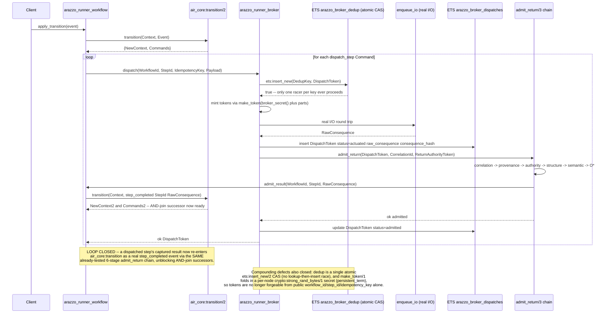
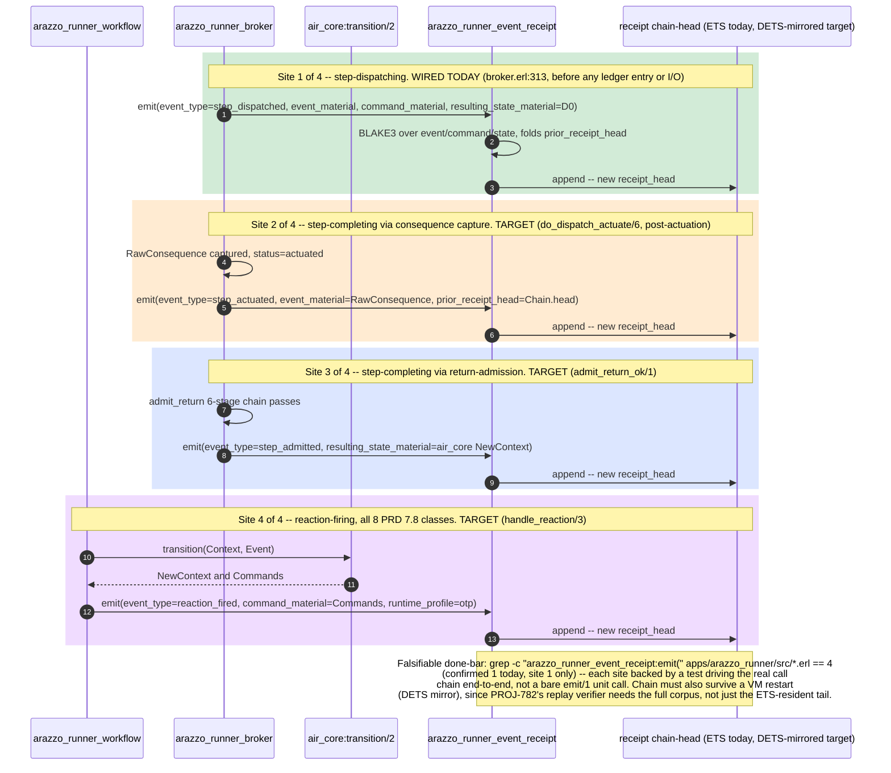
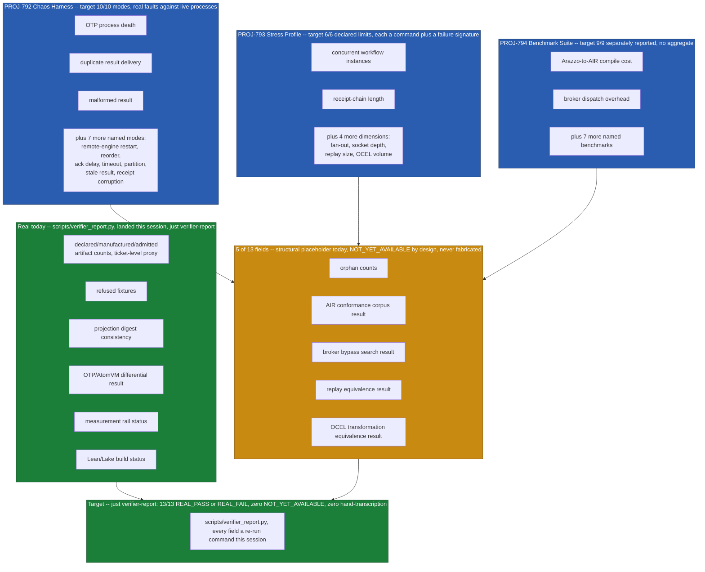
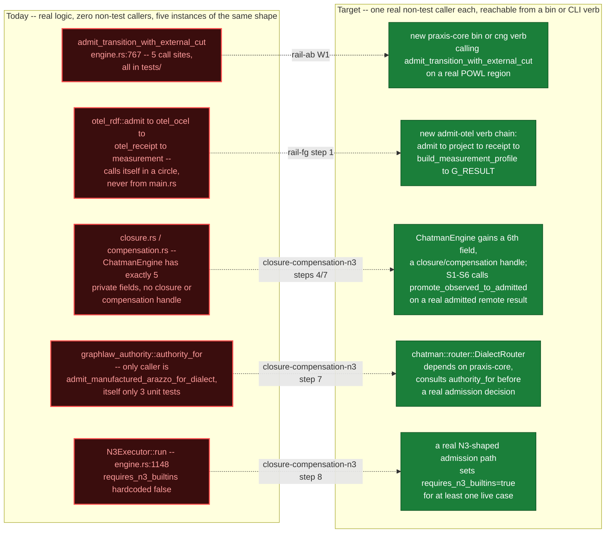
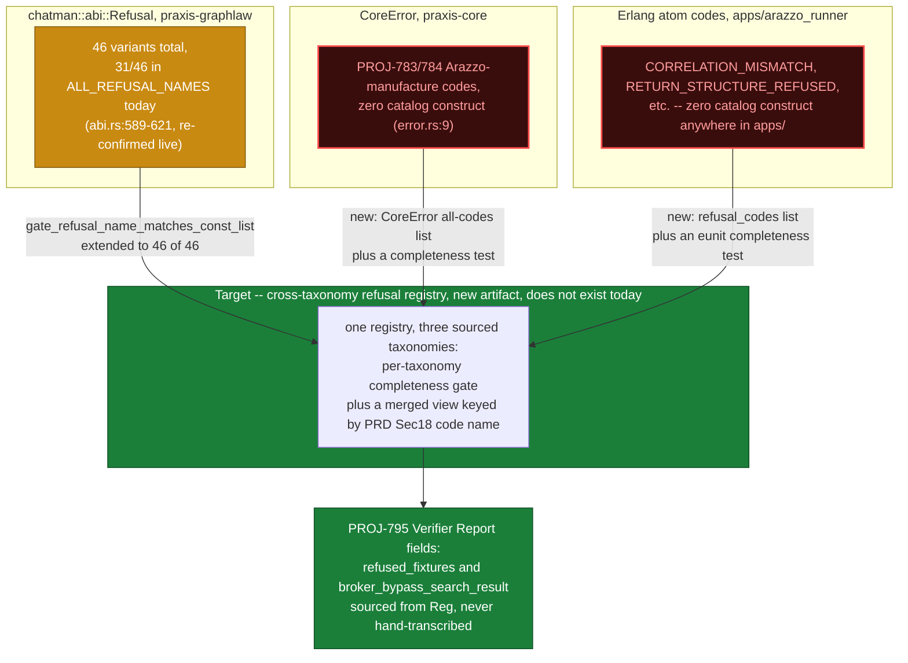
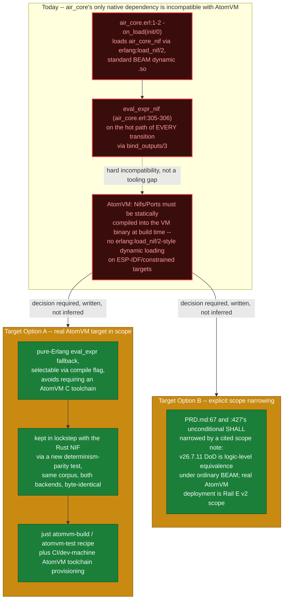

# Target-State Diagrams — v26.7.11 (Companion to SYSTEM_DIAGRAMS.md)

These diagrams show what six of the highest-value gaps identified across the Rail A–H planning passes look like **when closed** — target architecture, not current state. Cross-reference the six rail planning documents (Rail A/B, Rail C/D, Rail E, Rail F/G, Rail H, Closure/Compensation/N3/GraphLaw-Authority, Refusal-Catalog-Remainder, Acceptance-Verification-Ladder) for the evidence behind each gap. Where a live check during this diagramming pass (2026-07-11, this session) found a target mechanism already landed in the working tree, that is noted explicitly rather than smoothed into the "current state" framing — these are fast-moving files.

## 1. Broker Return-Path Closes the Loop (dispatch → real I/O → admit_return → air_core:transition advances)

Resolves the dead end in `SYSTEM_DIAGRAMS.md`'s "Sequence — Erlang Dispatch/Broker" (`do_dispatch_actuate/6` captured a result and returned without ever calling `admit_return/3`, ADVERSARIAL_DOD.md Tier-1 finding #1, re-confirmed open at the rail-cd/acceptance-verification-ladder reads ~22:52–22:57) together with the two compounding defects named alongside it (unsalted `make_token/1`, non-atomic TOCTOU dedup) — a live check this pass found all three closed in the current working tree (`arazzo_runner_broker.erl:249` `ets:insert_new/2` CAS, `:376` `admit_return` called from `do_dispatch_actuate/6`, `:591-599` `admit_return_ok/1` calling `arazzo_runner_workflow:admit_result/3`, `:756-783` `make_token/1` folding in a `persistent_term`-cached `broker_secret/0`), so this diagram doubles as a same-session verification of the target design.

## 2. Receipt Chain — All 4 Emission Sites Wired

Resolves the gap named in the refusal-catalog-remainder planning doc's PROJ-781 section — of the 4 event classes PRD.md:702's "every workflow execution SHALL extend a BLAKE3-linked receipt chain" covers, only site 1 (step-dispatching) is wired today; a live check this pass confirms `grep -c "arazzo_runner_event_receipt:emit(" apps/arazzo_runner/src/*.erl` is still exactly 1, at `arazzo_runner_broker.erl:313`, with sites 2–4 (consequence-capture, return-admission, reaction-firing) unwired.

## 3. Verification Ladder as a Real Running Gate

Resolves the acceptance-verification-ladder finding that 0/10 chaos modes, 0/6 stress dimensions, 0/9 benchmarks existed and "no script, binary, or `just` recipe exists" for PROJ-795 as of that read; a live check this pass found a first slice already landed at `scripts/verifier_report.py` (430 lines, `just verifier-report`) computing 8 of 13 PRD.md:1011-1027 fields for real and explicitly marking the other 5 (`orphan_counts`, `air_conformance_corpus_result`, `broker_bypass_search_result`, `replay_equivalence_result`, `ocel_transformation_equivalence_result`) as structural `NOT_YET_AVAILABLE` placeholders rather than fabricated values — the target closes exactly those 5 via PROJ-792/793/794.

## 4. Closing the Reachability Islands (the pattern repeated across every rail)

Resolves the single most-repeated finding across all six rail explorations — real, tested logic with zero non-test callers: `admit_transition_with_external_cut` has exactly 5 test-only call sites (rail-ab §2a, `engine.rs:767`, re-confirmed live this pass), the `cng` OTel→OCEL→receipt→measurement chain calls itself in a circle never reached from `main.rs` (rail-fg §2a), `ChatmanEngine` has exactly 5 private fields with no closure/compensation handle (closure-compensation-n3 §2.1), `graphlaw_authority::authority_for`'s only caller is exercised by 3 unit tests (closure-compensation-n3 §2.4), and `N3Executor::run` is unreachable because `requires_n3_builtins` is hardcoded `false` at `engine.rs:1148` (re-confirmed live this pass).

## 5. Cross-Taxonomy Refusal Catalog Feeds the Verifier Report

Resolves the structural finding in closure-compensation-n3 §2.2 — there is no single PRD §18 refusal catalog artifact; it is fragmented across three uncorrelated taxonomies with no shared registry: `chatman::abi::Refusal` (31/46 variants in `ALL_REFUSAL_NAMES`, `abi.rs:589-621`, re-confirmed live this pass), `CoreError` (`praxis-core/src/error.rs:9`, zero catalog construct), and Erlang atom codes in `apps/arazzo_runner` (zero catalog construct anywhere).

## 6. AtomVM Real Runtime Target (resolving the NIF/static-linking incompatibility)

Resolves the rail-e finding that `air_core`'s only native dependency is structurally incompatible with AtomVM, not merely untested — `eval_expr_nif` (`air_core.erl:305-306`) loads via `erlang:load_nif/2` on the hot path of every transition (`bind_outputs/3`), while AtomVM requires Nifs/Ports to be statically compiled into the VM binary at build time and has no `erlang:load_nif/2`-style dynamic loading on constrained targets — a materially stronger finding than PROJ-760's own "correctly out-of-scope future work" framing, which treats this as a tooling gap rather than a code-compatibility one.

---

Files/state checked live during this diagramming pass (not carried over from the planning docs without re-verification): `apps/arazzo_runner/src/arazzo_runner_broker.erl` (full return-path/token/dedup read, lines 249, 298-419, 591-650, 727-783), `apps/arazzo_runner/src/arazzo_runner_event_receipt.erl` + emission-site grep across `apps/arazzo_runner/src/*.erl`, `crates/praxis-graphlaw/src/chatman/engine.rs` (lines 767, 1148), `crates/praxis-graphlaw/src/chatman/abi.rs` (lines 589-621, enum variant count), `crates/praxis-core/src/lib.rs` (module list), `scripts/verifier_report.py` (full field inventory), `justfile:236-239`.