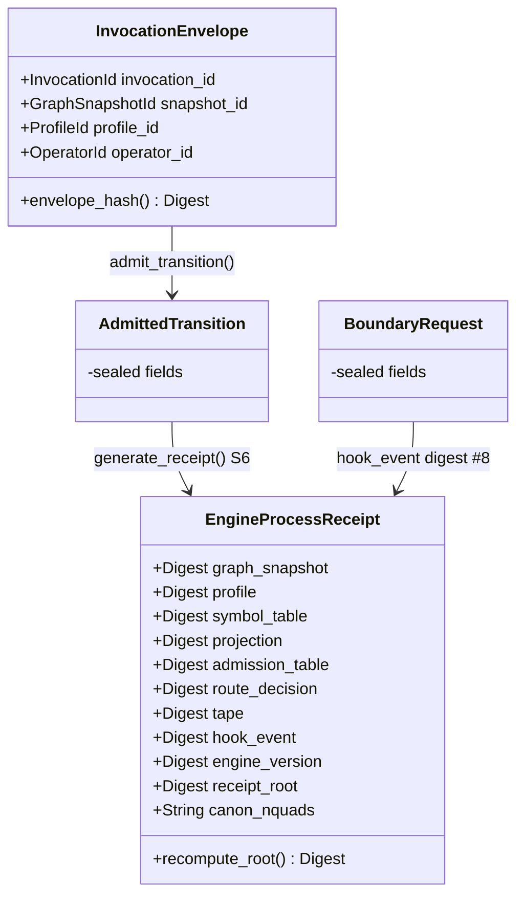

# ARD — Architecture Reference Document, Chatman Engine v26.7.9

Companion to `RELEASE_CONTROL.md` (exit criteria, single control surface). Every claim below
cites a file, test, or receipt; rows that cannot are marked UNKNOWN or GAP. Architectural claims
in the press release are reconciled in `## Claims Reconciliation` below, sharing its verdicts
and citations verbatim with `PRD.md` — the two documents must not diverge on status for the same
claim number.

## Claims Reconciliation

(Identical table to `PRD.md` — maintained as one logical table across both files per
`RELEASE_CONTROL.md` Sec. 4. See `PRD.md` for the full 11-row table and status vocabulary.
Architectural detail on rows 2-4, 8, 10 is expanded in Sec. 6/7/10/13 below.)

## 1. Architecture summary

Chatman Engine is a governed S1→S6 pipeline: fetch_snapshot → apply_owl_closure →
generate_pddl_plan → admit_powl_trace → trigger_knowledge_hooks → generate_receipt, implemented
in `crates/praxis-graphlaw/src/chatman/` as six single-lane files (`abi.rs`, `triple8.rs`,
`admission8.rs`, `router.rs`, `engine.rs`, `bridge.rs`; `mod.rs` doc comment: "one lane owns each
file"). Independent Gate F audit against commit `7d76019`
(`docs/chatman-engine/chicago_tdd_final_report.md`) gives verdict
`ADMITTED_DRY_RUN_PUBLISHABLE`, scoped to this S1-S6 surface.

## 2. Components

| Component | Location | Role | Lines | Gate B evidence |
|---|---|---|---|---|
| CE-ABI (envelope/receipt/refusal contract) | `chatman/abi.rs` | `InvocationEnvelope`, `Receipt`, 29-variant `Refusal` | 414 | present, compiles |
| Triple-8 substrate | `chatman/triple8.rs` | `Term8`, `RDFTriple8`/`RDFQuad8`, frozen `ProfileSymbolTable` closed-world interner + projection hashing | 448 | present, compiles |
| Admission-8 mask | `chatman/admission8.rs` | `ConstraintMask`, `Admission8`, 256-entry `AdmissionTable8` | 482 | present, compiles |
| Dialect router | `chatman/router.rs` | `Dialect`/`Route` enums (Ord encodes least-expressive-route law), `DialectRouter.decide()` | 778 | present, compiles |
| Engine (S1-S6) | `chatman/engine.rs` | `ChatmanEngine`, `AdmittedTransition`, `EngineProcessReceipt`, `verify_replay` | 1918 | present, compiles, 123 tests |
| Workflow bridge | `chatman/bridge.rs` | `TapeBridge`, `OrchestratedPlan` — S3→S4 bridging | 636 | present, compiles; full wiring EXCLUDED (Sec. 16) |

SHACL `CompiledShape`/Pattern-4 lanes (`crates/praxis-graphlaw/src/shacl/`) are tracked
separately as PROJ-415/416, not part of this component set. External dependencies integrated
through these lanes: `wasm4pm_compat` (OCEL validation, S4), `bcinr_pddl` (plan search, S3),
`bcinr_powl`/`bcinr_powl_receipt` (tape conformance + causal-frame chaining, S4/S6).

## 3. Core invariant

1. No panics/silent defaults — zero `.unwrap()`/`.expect(`/`panic!(`/`unsafe`/`SystemTime`/
   `Instant::now`/error-swallowing `.ok()` hits inside `src/chatman/` (Gate E static scan).
2. Receipts computed (BLAKE3, 9 constitutional digests + `receipt_root`), never asserted-in
   (`EngineProcessReceipt`, Gate B/D).
3. Sealed construction — `AdmittedTransition`/`BoundaryRequest` have private fields, only
   constructible via `ChatmanEngine::admit_transition` (Gate B).
4. Per-field replay verification, not whole-envelope — `verify_replay` (`engine.rs`),
   `ReplayMismatch` enum reports each field's mismatch independently.
5. Determinism — `receipt_root` byte-identical across 5 independent runs and 2 clean OCEL
   regenerations (Gate D).

## 4. Object model

The unit of standing is `EngineProcessReceipt` (alias `ProcessReceiptEnvelope`, `engine.rs`),
computed never asserted. Nine digests, constitutional (fixed) order:

| # | Field | Produced by | Content |
|---|---|---|---|
| 1 | `graph_snapshot` | S1 | RDFC-1.0 canonical N-Quads hash of input |
| 2 | `profile` | input | profile identity |
| 3 | `symbol_table` | S1/S2 | `ProfileSymbolTable` closed-world interner state |
| 4 | `projection` | S2 | `projection_hash()` of triple8 projection |
| 5 | `admission_table` | S2/S4 | `AdmissionTable8` hash (256-entry mask table) |
| 6 | `route_decision` | S2 | `DialectRouter` claim (Hot/Warm/Cold) |
| 7 | `tape` | S3/S4 | `Pddl8Tape`/`PowlTape` conformance digest |
| 8 | `hook_event` | S5 | sealed `BoundaryRequest` digest |
| 9 | `engine_version` | constant | pipeline version pin |

Plus `receipt_root` (BLAKE3 over 1-9, O(1) `recompute_root()`) and `canon_nquads` (retained for
replay). Other object-model surfaces: `InvocationEnvelope` (pre-processing identity, hashed via
`envelope_hash()`); `AdmittedTransition` and `BoundaryRequest` (sealed, private-field, no
external construction — a deliberate invariant, not an oversight); `ReplayMismatch` (the
negative object model — per-field fail-fast, not a generic error string); `Refusal` (29
variants — see Components; full catalog and taxonomy diagrammed at
`docs/chatman-engine/diagrams/asbuilt/AB-02`).



This diagram shows the receipt's static field shape; see
`docs/chatman-engine/diagrams/asbuilt/AB-06` for how material *flows into* these fields — the
two are complementary, not redundant.

## 5. Standing model

Two facts, disclosed side by side, neither silently overriding the other:

- Gate F verdict: `ADMITTED_DRY_RUN_PUBLISHABLE`, audited against commit `7d76019`
  (`docs/chatman-engine/chicago_tdd_final_report.md`).
- Compiled `target/praxis-standing/standing.json` and `docs/standing/REALITY_INDEX.md` show only
  `crate:chatman-common` at kind `RustCrate`, ladder `0`, standing `Discovered`;
  `crate:praxis-graphlaw` (where the actual code lives) is not represented as a distinct
  milestone entry either. Per `docs/standing/STANDING_SCHEMA_MILESTONE_GAP.md`, the compiled
  `cicd-standing.v1` schema has no `MilestoneArtifact` kind, so a scoped Gate F verdict cannot be
  represented as a milestone row — the ladder-0 reading describes the whole crate, not the
  chatman module specifically, and is documented as not evidence against Gate F.
- Per `docs/standing/CLAUDE_CODE_POLICY.md` ("if they disagree, the index wins and the doc/
  comment is out of date"): this document does not claim any ladder level for Chatman beyond
  what the compiled index actually shows (ladder 0, Discovered), even though the Gate F evidence
  trail is independently stronger. Row: **Chatman Engine standing per compiled index** —
  UNKNOWN/Discovered (ladder 0) — GAP: schema cannot express milestone-level standing yet —
  PLANNED fix, out of scope this pass.

## 6. Rule model

`apply_owl_closure` (S2) routes via `DialectRouter` into the underlying `praxis-graphlaw` rule
engines (N3/Datalog per `router.rs` `Dialect` ordering). SHACL `CompiledShape` population for
the chatman surface is **EXCLUDED** — PROJ-415, open, `crates/praxis-graphlaw/src/shacl/
model.rs` has 5 placeholder fields not yet populated. Do not claim SHACL coverage for chatman
transitions.

## 7. Planner domain

S3 `generate_pddl_plan` integrates `bcinr_pddl` and the tested `crates/pddl-index` grounder —
this is chatman's own planning path, verified in Gate B/C. This is a **different** pipeline from
`docs/PDDL_INTEGRATION_SUMMARY.md`'s RDF→PDDL sketch, which self-labels its status "Completed
design (schema only, not full PDDL solver implementation)" — the two must not be cited
interchangeably; test coverage of chatman's `bcinr_pddl` integration does not imply coverage of
the unrelated schema-only sketch, and vice versa.

## 8. CLI architecture

No dedicated `chatman` CLI verb was found under `src/verbs/` or crate `src/bin/` in this
session's search (`grep -rn chatman src/verbs/ src/main.rs` and equivalent — no hits beyond
unrelated top-level files `src/mfg.rs`, `src/frontier.rs`, `src/ops.rs`,
`src/bin/case_study_judge.rs`, none of which expose a chatman verb). Status: **PLANNED/UNKNOWN**
— programmatic access is via `ChatmanEngine::{in_memory, open, load_snapshot, admit_transition,
actuate}` (`engine.rs`) as a library API, not a CLI surface.

## 9. File architecture

```
crates/praxis-graphlaw/src/chatman/
├── mod.rs        one-lane-per-file layout; pub use abi::Refusal
├── abi.rs         (414 lines) CE-ABI: envelopes, receipts, 29-variant Refusal
├── triple8.rs     (448 lines) bounded Term8 universe, ProfileSymbolTable
├── admission8.rs  (482 lines) AdmissionTable8, 256-entry admission masks
├── router.rs      (778 lines) DialectRouter, least-expressive-route law
├── engine.rs      (1918 lines) S1-S6 pipeline, ChatmanEngine, EngineProcessReceipt
└── bridge.rs      (636 lines) TapeBridge, OrchestratedPlan (S3->S4, wiring deferred)

crates/praxis-graphlaw/tests/chatman_*.rs      test surface (123 tests, Gate C)
docs/chatman-engine/
├── chicago_tdd_final_report.md                Gate F verdict (this ARD's evidentiary floor)
├── DEFINITION_OF_DONE.md
├── evidence/                                  gate_a.txt .. gate_f_auditor_packet.md
├── diagrams/asbuilt/                          AB-01..AB-10 Mermaid as-built diagrams
└── ontology/ceng.ttl
```

## 10. Dataflow

Full step sequence diagrammed at `docs/chatman-engine/diagrams/asbuilt/AB-01`; this section
states the six steps as prose-of-record with citations:

1. **S1 fetch_snapshot** — RDFC-1.0 canonicalize input, hash canonical N-Quads (`engine.rs`).
2. **S2 apply_owl_closure** — route via `DialectRouter.decide()`, materialize via `TripleStore`
   into a **sibling** `<snapshot#closure>` graph — the input snapshot is never mutated. This
   immutability is a deliberate dataflow invariant, not incidental.
3. **S3 generate_pddl_plan** — `bcinr_pddl` → `Pddl8Tape`.
4. **S4 admit_powl_trace** — `wasm4pm_compat` OCEL validation + `bcinr_powl` tape conformance +
   `bcinr_powl_receipt` causal-frame chaining; violations short-circuit to
   `Refusal::TraceUnlawful`.
5. **S5 trigger_knowledge_hooks** — sealed `BoundaryRequest`, not constructible outside the
   module.
6. **S6 generate_receipt** — assembles the 9 digests in constitutional order, BLAKE3 root;
   **re-verifies the S1 hash before sealing as a TOCTOU guard** (defense against a snapshot swap
   mid-pipeline).

Determinism: 8 regenerated OCEL suites and 5 consecutive e2e runs produced byte-identical
`receipt_root` (Gate D). The sealed digest is deterministic; the raw `.ocel.json` bodies are
not — this asymmetry is part of the dataflow contract: only the receipt, not incidental artifact
bytes, is the object of standing.

Known incomplete edge: the S3→S4 handoff via `OrchestratedPlan`/`TapeBridge` (`bridge.rs`) is
present but full engine-side wiring is deferred (Sec. 16 exclusions).

**New, separate capability — PDDL-plan-to-POWL-v2 projection:** a distinct mechanism from the
`bridge.rs` `TapeBridge::map_to_workflow` handoff above (that handoff remains unwired/unused, per
the exclusion immediately above — this addition does not change that). `chatman/
powl_projection.rs` adds `pub fn project_pddl_tape_to_powl(tape: &Pddl8Tape) -> Result<powl2_decompose::Powl,
Refusal>` (projects a `Pddl8Tape` into a `powl2_decompose::Powl` model, O(n^2) in tape length for
the transitively-closed total-order relation, bounded by the 8-bit tape width) and `pub fn
powl_to_turtle(model: &Powl, base_iri: &str) -> String` (deterministic Turtle serialization,
`powl2:` vocabulary). `chatman/engine.rs` gained `ChatmanEngine::plan_tape_for_snapshot(&self,
snapshot_id: &GraphSnapshotId) -> Result<Pddl8Tape, Refusal>`, exposing the S3-computed plan tape
without touching the sealed `AdmittedTransition`/`EngineProcessReceipt` shape. Exercised by
`crates/praxis-graphlaw/tests/chatman_pddl_to_powl_projection.rs`. Status: **PARTIAL** — code
lands in `chatman/powl_projection.rs` and `engine.rs::plan_tape_for_snapshot`, exercised by
`tests/chatman_pddl_to_powl_projection.rs`; not yet confirmed by a passing `just test-changed` run
in this session as of this writing.

## 11. Design system

Vocabulary is legal-industrial — admission, standing, receipt, refusal, replay — extending, not
replacing, the house vocabulary from `docs/releases/v26.7.6/ARD.md` Sec. 11. Chatman-specific
terms (envelope, tape, hook, boundary request) are introduced as extensions of that base. No
naked success claims: every claim here cites a file/test/receipt. "PDDL v3.1" and "POWL v2"
language, wherever used in press/marketing copy, is a standards-facing projection, not a
verified spec-compliance claim — no agent in this document's evidence trail confirmed literal
PDDL v3.1 or POWL v2 spec-version conformance in code (see Claims Reconciliation rows 2-3).

## 12. Demo architecture

No chatman-specific example/demo fixture was located in this session's search. Status:
**PLANNED/UNKNOWN** — do not assert a one-command demo without a confirmed fixture path.

## 13. Market architecture

This section carries the architectural detail behind Claims Reconciliation rows 2-4, 8, 10:

- **"PDDL v3.1" / "POWL v2"** (rows 2-3): mechanism ALIVE (`bcinr_pddl`/`bcinr_powl`
  integration, tested); literal standards-version conformance UNKNOWN. Scope any external claim
  to "PDDL-style planning via bcinr-pddl/pddl-index" and "POWL 2.0 model per powl2-decompose,"
  not literal spec compliance, until conformance testing is added.
- **OCEL export** (row 4): `crates/ocel/ocel_gap_report.md`'s "No gaps found. All systems
  functional." is flagged UNVERIFIED — a one-line, content-free claim, not usable as evidence
  for any OCEL-related marketing claim.
- **Deterministic replay / hash-mismatch refusal** (rows 8, 10): core engine `verify_replay` is
  ALIVE; the WASM-surfaced `Status::HashMismatch` path is PROJ-417, open, not yet wired. Any
  external claim of "deterministic replay" must be scoped to the core engine, not the WASM
  surface, until PROJ-417 closes.
- **New evidence for claim #3 ("POWL v2 projection")**: a genuine PDDL-tape-to-POWL-v2 code path
  now exists — `chatman/powl_projection.rs::project_pddl_tape_to_powl` /
  `chatman/powl_projection.rs::powl_to_turtle`, plus `engine.rs::plan_tape_for_snapshot` (see
  Dataflow section, Sec. 10) — PARTIAL pending test confirmation (no `just test-changed` run cited
  for it in this session). This does not upgrade claim #3's Claims Reconciliation verdict here:
  per `RELEASE_CONTROL.md`'s rule that the Claims Reconciliation table is shared verbatim with
  `PRD.md` and both files must update together in the same commit, this note only points at the
  new evidence. If/when confirmed by a passing test run, claim #3's status should be revisited
  across both `PRD.md` and `ARD.md` together.
- **"Production-ready"/"publish-ready"** language: must be scoped per `no-overclaiming.md` and
  `docs/standing/CLAUDE_CODE_POLICY.md`. The correct scoped term, matching the Gate F verdict
  string exactly, is "`ADMITTED_DRY_RUN_PUBLISHABLE`, scoped to S1-S6" — never unscoped
  "production-ready."

## 14. Adversarial architecture

The Gate F audit process is itself the adversarial-review mechanism: an independent,
non-authoring auditor re-derived every command in-session against a clean `git status`
precondition, signed 2026-07-10T01:23:35Z. Findings preserved rather than hidden: 5 `#[ignore]`
tests with documented stale rationale (not vacuous passes); non-deterministic `.ocel.json`
`event_id` values while the sealed digest remains deterministic; the PROJ-411..414
ticket-status/Gate-F-disposition mismatch (Sec. 5 of `PRD.md`).

## 15. Final-day outputs

| Output | Where | Status at authoring |
|---|---|---|
| Gate F report | `docs/chatman-engine/chicago_tdd_final_report.md` | exists, verdict `ADMITTED_DRY_RUN_PUBLISHABLE` |
| Ticket reconciliation | `docs/jira/v26.7.8/tickets/PROJ-411-417-reconciliation.md` | exists |
| Six chatman source files | `crates/praxis-graphlaw/src/chatman/` | exist, compile, Gate B PASS |
| Test suite | `crates/praxis-graphlaw/tests/chatman_*.rs` | 123 tests / 11 static gates PASS (Gate C) |
| OCEL receipt evidence | `.cargo-cicd/ocel/chatman/*.receipt.json` | 8 suites, byte-identical across 2 regenerations |
| `docs/releases/v26.7.9/` doc pair | this directory | PRD.md, ARD.md, RELEASE_CONTROL.md present |
| Standing-index milestone representation | `target/praxis-standing/standing.json` | GAP, PLANNED (Sec. 5) |
| Mutation/coverage metrics | Gate E items 4-5 | UNVERIFIED/advisory |
| PROJ-415/416/417 | `docs/jira/v26.7.8/tickets/` | OPEN, EXCLUDED from this closure |

## 16. Definition of done

1. Gate A/B(+C)/D/E all PASS per `docs/chatman-engine/chicago_tdd_final_report.md`, with Gate E
   mutation/coverage explicitly UNVERIFIED/advisory, not silently claimed.
2. Every claim in this document cites a specific test/receipt/file that exists.
3. No invariant of Sec. 3 is violated.
4. Per `docs/standing/CLAUDE_CODE_POLICY.md`: the compiled `standing.json`/`REALITY_INDEX.md`
   was read fresh before any "done" claim — "if they disagree, the index wins." This document's
   Gate F claims coexist with, and do not override, the ladder-0 standing.json reading (Sec. 5);
   both are disclosed, neither is hidden.
5. Receipts computed and chained, never asserted (Gate D evidence).

**Hard exclusions** (not gate failures — scope boundaries): PROJ-415 (SHACL `CompiledShape`),
PROJ-416 (Pattern-4 canonical receipts), PROJ-417 (WASM `HashMismatch` replay surfacing), N3
cubic scaling, S3→S4 `OrchestratedPlan`/`TapeBridge` wiring, crate-wide non-Chatman clippy debt.

Anything short of the five points above, and specifically anything only evidenced by Gate F but
not yet reflected in `standing.json`, stays UNKNOWN in `RELEASE_CONTROL.md`. That file, not this
ARD alone, is the single control surface for what "done" means for v26.7.9.
